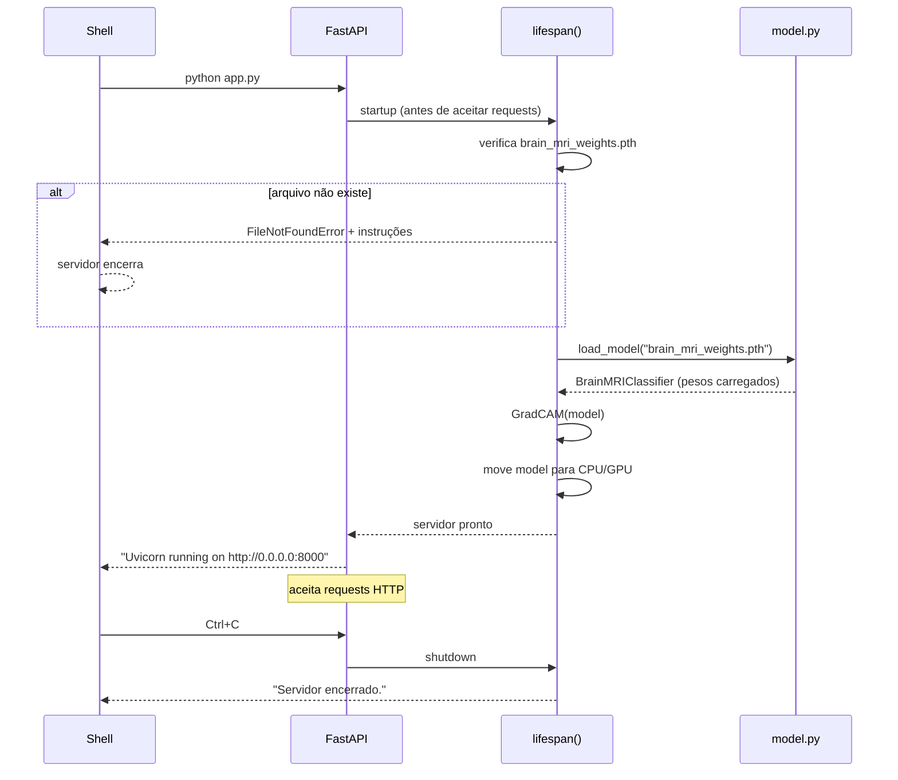
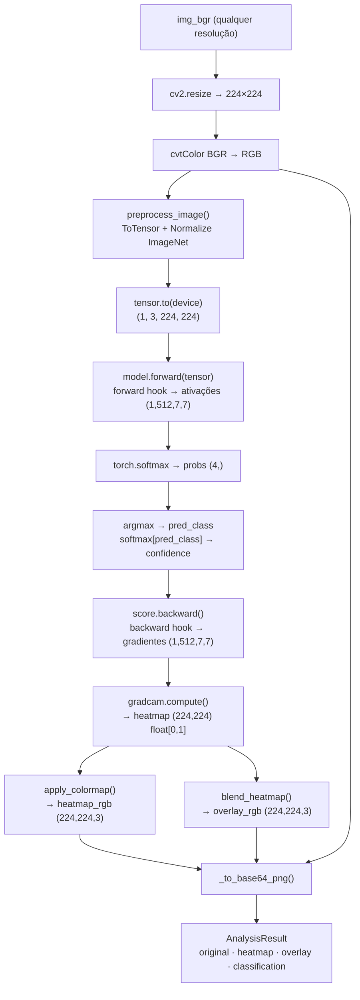

# ⚡ app.py — Guia técnico e didático

> Servidor FastAPI que orquestra o pipeline completo de análise de MRI cerebral:
> upload de imagem → classificação com ResNet18 → heatmap Grad-CAM → resposta JSON.

---

## Sumário

1. [Visão geral](#visão-geral)
2. [Pré-requisitos para rodar](#pré-requisitos-para-rodar)
3. [Ciclo de vida do servidor](#ciclo-de-vida-do-servidor)
4. [Endpoints da API](#endpoints-da-api)
5. [O pipeline de análise](#o-pipeline-de-análise)
6. [Validação e tratamento de erros](#validação-e-tratamento-de-erros)
7. [Schemas Pydantic](#schemas-pydantic)
8. [Decisões de design](#decisões-de-design)
9. [Como testar a API](#como-testar-a-api)
10. [Referências](#referências)

---

## Visão geral

O `app.py` é o ponto de entrada do backend. Ele não contém lógica de
Machine Learning — essa responsabilidade está em `model.py` e `gradcam.py`.
O papel do `app.py` é ser o **orquestrador**: receber requests HTTP,
delegar para os módulos corretos e devolver respostas JSON bem formatadas.

```
Frontend (TypeScript)
        │
        │  HTTP (JSON + multipart/form-data)
        ▼
   ┌─────────────┐
   │   app.py    │  ← você está aqui
   │  FastAPI    │
   └──────┬──────┘
          │ delega para
    ┌─────┼─────────────────────┐
    ▼     ▼                     ▼
model.py  gradcam.py   brain_regions.py
ResNet18  Grad-CAM     Atlas cerebral
```

---

## Pré-requisitos para rodar

### 1. Arquivo de pesos treinados

O servidor **não sobe** sem o arquivo `brain_mri_weights.pth` na pasta `backend/`.
Se o arquivo não existir, o servidor imprime instruções no terminal e encerra.

Para gerar os pesos: veja [MODEL_README.md](MODEL_README.md).

### 2. Dependências Python

```bash
cd backend
python -m venv venv
source venv/bin/activate        # Windows: venv\Scripts\activate
pip install -r requirements.txt
```

### 3. Iniciar o servidor

```bash
python app.py
```

Saída esperada:

```
────────────────────────────────────────────────────────────
  MRI Brain XAI Viewer — Backend
────────────────────────────────────────────────────────────
  Rodando em CPU (sem GPU detectada)

  Modelo carregado em 1.42s
  Classes: ['Glioma', 'Meningioma', 'Normal', 'Pituitary Tumor']
  Arquivo: brain_mri_weights.pth
  Device:  CPU

  Servidor pronto em http://localhost:8000
  Swagger UI:  http://localhost:8000/docs
────────────────────────────────────────────────────────────
```

---

## Ciclo de vida do servidor



### Por que usar `lifespan` em vez de `@app.on_event`?

O FastAPI descontinuou `@app.on_event("startup")` em favor do padrão
`@asynccontextmanager lifespan`. O motivo é testabilidade: com `lifespan`,
você pode usar `async with app` nos testes para controlar o ciclo de vida
sem subir o servidor de verdade.

### Por que carregar o modelo no startup?

O ResNet18 carregado ocupa ~45 MB de RAM e leva ~1.5s para carregar do disco.
Fazer isso a cada request tornaria o sistema 30× mais lento.

```
Sem cache: cada request = 1.5s (load) + 2.5s (inferência) = 4.0s
Com cache: cada request = 0.0s (load) + 2.5s (inferência) = 2.5s
```

---

## Endpoints da API

### Mapa completo

| Método | Path | Body | Resposta |
|---|---|---|---|
| `POST` | `/analyze` | `multipart: file` | `AnalysisResult` |
| `POST` | `/compare` | `multipart: file1, file2` | `CompareResult` |
| `POST` | `/brain-region/coords` | `JSON: {u, v}` | Dict da região |
| `GET` | `/brain-region/{id}` | — | Dict da região |
| `GET` | `/brain-regions` | — | Lista de regiões |
| `GET` | `/health` | — | `HealthResponse` |

### `POST /analyze`

Endpoint principal. Recebe uma imagem e executa o pipeline completo.

**Request:**
```bash
curl -X POST http://localhost:8000/analyze \
  -F "file=@mri_brain.jpg"
```

**Response (200 OK):**
```json
{
  "original": "iVBORw0KGgoAAAANSUhEUgA...",
  "heatmap":  "iVBORw0KGgoAAAANSUhEUgA...",
  "overlay":  "iVBORw0KGgoAAAANSUhEUgA...",
  "classification": {
    "label": "Glioma",
    "predicted_class": 0,
    "confidence": 0.9312,
    "probabilities": {
      "Glioma": 0.9312,
      "Meningioma": 0.0421,
      "Normal": 0.0198,
      "Pituitary Tumor": 0.0069
    }
  }
}
```

As strings base64 codificam PNGs 224×224 que podem ser usados diretamente
como `src` de imagens no frontend:

```typescript
// api.ts (frontend)
const dataURL = `data:image/png;base64,${result.original}`
texture = new THREE.TextureLoader().load(dataURL)
```

### `POST /compare`

Mesmo pipeline do `/analyze`, executado duas vezes em sequência.

**Request:**
```bash
curl -X POST http://localhost:8000/compare \
  -F "file1=@paciente1.jpg" \
  -F "file2=@paciente2.jpg"
```

**Response (200 OK):**
```json
{
  "patient1": { ... AnalysisResult ... },
  "patient2": { ... AnalysisResult ... }
}
```

### `POST /brain-region/coords`

Recebe coordenadas UV de um clique no Three.js e retorna a região anatômica.

**Request:**
```bash
curl -X POST http://localhost:8000/brain-region/coords \
  -H "Content-Type: application/json" \
  -d '{"u": 0.5, "v": 0.15}'
```

**Response (200 OK):**
```json
{
  "region_id": "frontal_lobe",
  "name": "Lobo Frontal",
  "function": "O lobo frontal é o maior lobo cerebral...",
  "clinical_relevance": "Lesões no córtex motor primário...",
  "pathologies": ["Glioblastoma (GBM)...", ...],
  "brodmann_areas": ["4 (motor primário)", ...],
  "vascularization": "Artéria cerebral média (MCA)...",
  "color": "#4A90D9"
}
```

**Errors:**
```json
// u ou v fora de [0.0, 1.0]:
{ "detail": [{"msg": "Input should be less than or equal to 1", ...}] }
```

### `GET /health`

```bash
curl http://localhost:8000/health
```

```json
{
  "status": "ok",
  "version": "1.0.0",
  "model_loaded": true,
  "model_file": "brain_mri_weights.pth",
  "device": "CPU",
  "classes": ["Glioma", "Meningioma", "Normal", "Pituitary Tumor"],
  "startup_time_seconds": 1.423,
  "uptime_seconds": 124.5
}
```

---

## O pipeline de análise

A função `_run_analysis_pipeline()` é o núcleo do sistema.
Ela é chamada tanto pelo `/analyze` quanto pelo `/compare`.



### Por que `torch.enable_grad()` dentro do endpoint?

O FastAPI executa handlers em contexto assíncrono onde o PyTorch pode
estar em modo `no_grad` por padrão em alguns ambientes. O `enable_grad()`
garante que o autograd está ativo para o Grad-CAM, independente do contexto
externo. O modelo continua em `eval()` — o que desativa Dropout e BatchNorm
estocástico, mas não o grafo computacional.

```python
# Correto — garante gradientes mesmo em contexto assíncrono
with torch.enable_grad():
    logits = model(tensor)
score = logits[0, pred_class]
score.backward()    # funciona porque enable_grad estava ativo no forward
```

---

## Validação e tratamento de erros

### Camadas de validação

```
Request HTTP
    │
    ▼ FastAPI (MIME type header)
_validate_image_file()
    │
    ▼ FastAPI (leitura do body)
_read_and_validate_file()   ← tamanho máximo 10 MB
    │
    ▼ OpenCV
_decode_image()             ← conteúdo decodificável como imagem
    │
    ▼ Pydantic (para /brain-region/coords)
CoordsPayload               ← u e v em [0.0, 1.0]
    │
    ▼ Pipeline
_run_analysis_pipeline()    ← erros internos → HTTP 500
```

### Códigos de status utilizados

| Código | Situação |
|---|---|
| `200 OK` | Sucesso |
| `400 Bad Request` | Tipo MIME inválido, arquivo vazio, imagem corrompida |
| `413 Request Entity Too Large` | Arquivo > 10 MB |
| `422 Unprocessable Entity` | Payload JSON inválido (Pydantic) |
| `500 Internal Server Error` | Erro inesperado no pipeline |
| `503 Service Unavailable` | Modelo não carregado |

---

## Schemas Pydantic

Os schemas cumprem duas funções: validação automática dos inputs e
documentação automática no Swagger UI (`/docs`).

```python
class CoordsPayload(BaseModel):
    u: float = Field(..., ge=0.0, le=1.0)   # ge=greater_equal, le=less_equal
    v: float = Field(..., ge=0.0, le=1.0)
```

O Pydantic valida os tipos, os ranges e gera automaticamente o schema
JSON no `/docs` — você não precisa documentar os campos manualmente.

### Por que Pydantic para os responses também?

`AnalysisResult` e `HealthResponse` como `BaseModel` servem como contrato
formal da API. O `response_model` no decorator do endpoint instrui o FastAPI
a validar a resposta antes de enviar — garante que o servidor nunca envie
um campo faltando ou com tipo errado.

---

## Decisões de design

### Processamento sequencial no `/compare`

O `/compare` processa os dois arquivos em sequência, não em paralelo.
O processamento paralelo com `asyncio.gather` seria mais eficiente,
mas o PyTorch não é thread-safe quando múltiplas chamadas `backward()`
compartilham o mesmo modelo. Para o MVP com poucos usuários simultâneos,
o processamento sequencial é mais seguro.

**Para escalar:** criar um pool de modelos (um por worker) ou usar
`torch.multiprocessing` com `spawn` context.

### Remoção do campo `coords` nas respostas de região

O campo `coords` do `BRAIN_REGIONS` contém as coordenadas UV internas
do atlas — é um detalhe de implementação que o cliente não precisa conhecer.
Remover da resposta reduz o payload e evita que o frontend faça suposições
sobre a geometria do atlas.

### `allow_origins` no CORS

Em desenvolvimento, o frontend roda em `http://localhost:3000` (Vite).
O CORS está configurado para aceitar apenas essa origem — não `"*"` —
porque credentials (`allow_credentials=True`) e `"*"` são incompatíveis
pelo padrão CORS. Em produção, substitua pelo domínio real:

```python
allow_origins=["https://seu-dominio.com"]
```

---

## Como testar a API

### Swagger UI (recomendado para exploração)

Abra `http://localhost:8000/docs` no browser após subir o servidor.
O Swagger UI permite testar todos os endpoints com upload de arquivo
sem precisar de curl ou Postman.

### curl

```bash
# Health check
curl http://localhost:8000/health | python -m json.tool

# Analisar MRI
curl -X POST http://localhost:8000/analyze \
  -F "file=@/caminho/para/mri.jpg" \
  | python -m json.tool

# Comparar dois MRIs
curl -X POST http://localhost:8000/compare \
  -F "file1=@paciente1.jpg" \
  -F "file2=@paciente2.jpg" \
  | python -m json.tool

# Região por coordenadas
curl -X POST http://localhost:8000/brain-region/coords \
  -H "Content-Type: application/json" \
  -d '{"u": 0.5, "v": 0.15}' \
  | python -m json.tool

# Listar regiões
curl http://localhost:8000/brain-regions | python -m json.tool
```

### Python (teste de integração)

```python
import requests
import base64
from PIL import Image
import io

BASE = "http://localhost:8000"

# Health
r = requests.get(f"{BASE}/health")
print(r.json())

# Analyze
with open("mri_test.jpg", "rb") as f:
    r = requests.post(f"{BASE}/analyze", files={"file": f})

data = r.json()
print(f"Classe: {data['classification']['label']}")
print(f"Confiança: {data['classification']['confidence']:.1%}")

# Salva heatmap em disco para inspecionar
heatmap_bytes = base64.b64decode(data["heatmap"])
Image.open(io.BytesIO(heatmap_bytes)).save("heatmap_resultado.png")
print("Heatmap salvo em heatmap_resultado.png")
```

---

## Referências

- **FastAPI**: Ramírez, S. — [fastapi.tiangolo.com](https://fastapi.tiangolo.com)
- **Lifespan events**: [FastAPI docs — Lifespan Events](https://fastapi.tiangolo.com/advanced/events/)
- **Pydantic v2**: [docs.pydantic.dev](https://docs.pydantic.dev)
- **CORS**: [MDN Web Docs — Cross-Origin Resource Sharing](https://developer.mozilla.org/en-US/docs/Web/HTTP/CORS)
- **Uvicorn**: [uvicorn.org](https://www.uvicorn.org)
- **torch.enable_grad**: [PyTorch docs](https://pytorch.org/docs/stable/generated/torch.enable_grad.html)

---

*Parte do projeto [MRI Brain XAI Viewer](../README.md) ·
veja também [model.py](MODEL_README.md), [gradcam.py](GRADCAM_README.md)
e [brain_regions.py](BRAIN_REGIONS_README.md)*