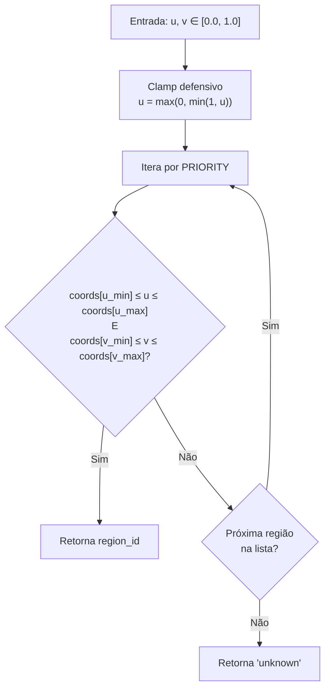

# 🧬 brain_regions.py — Guia técnico e didático

> Atlas cerebral simplificado para mapeamento de cliques em imagens de MRI 3D.
> Este documento explica a anatomia, o sistema de coordenadas UV, o algoritmo
> de detecção de regiões e as decisões de design do módulo.

---

## Sumário

1. [O que este módulo faz](#o-que-este-módulo-faz)
2. [O sistema de coordenadas UV](#o-sistema-de-coordenadas-uv)
3. [O atlas — BRAIN_REGIONS](#o-atlas--brain_regions)
4. [Regiões mapeadas](#regiões-mapeadas)
5. [O algoritmo de mapeamento](#o-algoritmo-de-mapeamento)
6. [O sistema de prioridade](#o-sistema-de-prioridade)
7. [Funções públicas](#funções-públicas)
8. [Integração com o sistema](#integração-com-o-sistema)
9. [Limitações e trabalhos futuros](#limitações-e-trabalhos-futuros)
10. [Referências anatômicas](#referências-anatômicas)

---

## O que este módulo faz

Quando o usuário clica em uma região do plano 3D no browser, o Three.js
calcula as coordenadas UV do ponto clicado na textura da MRI. Esse par `(u, v)`
é enviado ao backend, que precisa responder:

> **"O usuário clicou onde anatomicamente? O que essa região faz? Quais patologias a afetam?"**

O `brain_regions.py` é o dicionário que responde essa pergunta: mapeia
coordenadas geométricas para conhecimento anatômico e clínico.

```
Clique na UI
    │
    ▼ Three.js Raycasting
coordenadas UV (u=0.45, v=0.20)
    │
    ▼ POST /brain-region/coords
get_region_by_coords(0.45, 0.20)
    │
    ▼ Retorna: "frontal_lobe"
get_region_info("frontal_lobe")
    │
    ▼ JSON com nome, função, clínica, patologias
Painel lateral na UI
```

---

## O sistema de coordenadas UV

### O que são coordenadas UV?

UV são coordenadas de textura normalizadas no intervalo `[0, 1]`. O Three.js
as gera automaticamente via raycasting quando o usuário clica num `PlaneGeometry`.

```
(0,0)────────────────(1,0)
  │                    │
  │    textura MRI     │   u: 0 = esquerda, 1 = direita
  │                    │   v: 0 = topo,     1 = base
  │                    │
(0,1)────────────────(1,1)
```

### Mapeamento UV para anatomia cerebral (corte axial)

O corte axial é a fatia horizontal do cérebro vista de cima. A imagem
típica de MRI axial ao nível do tálamo expõe:

```
u=0                    u=0.5                  u=1
 │                       │                     │
 ├─────────────────────────────────────────────┤ v=0.00
 │              LOBO FRONTAL                   │
 │         (planejamento, movimento, fala)      │
 ├──────────┬────────────────────┬─────────────┤ v=0.30
 │ Temporal │    LOBO PARIETAL   │ Temporal    │
 │  Direito │  (sensação, espaço)│  Esquerdo   │
 │  (faces) ├────────────────────┤ (linguagem) │ v=0.38
 │  u<0.22  │   CORPO CALOSO     │   u>0.78    │
 │          │ (conexão hemis.)   │             │ v=0.54
 │          ├────────────────────┤             │
 │          │  TRONCO CEREBRAL   │             │ v=0.65
 ├──────────┴────────────────────┴─────────────┤
 │              LOBO OCCIPITAL                  │
 │              (visão primária)                │
 ├─────────────────────────────────────────────┤ v=0.73
 │                CEREBELO                      │
 │         (coordenação, equilíbrio)            │
 └─────────────────────────────────────────────┘ v=1.00
```

### Convenção radiológica vs. neurológica

> ⚠️ **Atenção importante:** Nas imagens de MRI existe uma convenção de visualização:
>
> - **Convenção radiológica** (padrão em imagens diagnósticas): a **esquerda** da imagem
>   corresponde ao **lado direito do paciente**. A imagem é como se você estivesse
>   olhando o paciente deitado pelos pés.
>
> - **Convenção neurológica** (usada em alguns sistemas): a esquerda da imagem =
>   esquerda do paciente.
>
> Este sistema usa a **convenção neurológica** para o mapeamento UV, ou seja:
> `u < 0.22` = lobo temporal **esquerdo** do paciente.
> Adapte conforme necessário para o padrão DICOM do seu dataset.

---

## O atlas — BRAIN_REGIONS

O dicionário `BRAIN_REGIONS` é o coração do módulo. Cada chave é um ID de região
e o valor é um dicionário com os seguintes campos:

```python
{
    "name": str,                 # Nome em português para exibição na UI
    "function": str,             # Função anatômica e fisiológica detalhada
    "clinical_relevance": str,   # Relevância clínica, síndromes e déficits
    "pathologies": list[str],    # Principais patologias que afetam a região
    "brodmann_areas": list[str], # Áreas de Brodmann correspondentes
    "vascularization": str,      # Artérias que irrigam a região
    "color": str,                # Cor hex para identificação visual na UI
    "coords": {                  # Caixa delimitadora no espaço UV [0,1]
        "u_min": float,
        "u_max": float,
        "v_min": float,
        "v_max": float,
    }
}
```

### Por que usar caixas retangulares (bounding boxes)?

O mapeamento real de regiões cerebrais seria feito com máscaras de segmentação
pixel-a-pixel (como no atlas AAL com 116 regiões em espaço MNI). As caixas
retangulares são uma aproximação intencional que:

- **Funciona sem dependência de bibliotecas** como `nibabel` ou `nilearn`
- **Dispensa registro de imagem** (processo complexo de alinhar o MRI do paciente ao atlas)
- **É suficientemente precisa** para fins educacionais e de demonstração
- **Executa em microsegundos** vs. segundos para consulta volumétrica

A seção [Limitações e trabalhos futuros](#limitações-e-trabalhos-futuros) descreve
como evoluir para um atlas real.

---

## Regiões mapeadas

### 1. Lobo Frontal

| Campo | Valor |
|---|---|
| Função principal | Planejamento, controle motor, fala (Broca) |
| Córtex primário | Motor (área 4 de Brodmann) — giro pré-central |
| Área de linguagem | Área de Broca (44 e 45) — hemisfério dominante |
| Irrigação | Artéria cerebral média (MCA) lateral; ACA face medial |
| Déficit clínico | Hemiparesia contralateral; afasia de Broca; síndrome disexecutiva |
| Coordenadas UV | u: 0.15–0.85, v: 0.00–0.32 |

```
┌─────────────────────────┐
│      LOBO FRONTAL       │ ← v = 0.00 a 0.32
│  [planejamento, motor]  │   u = 0.15 a 0.85
└─────────────────────────┘
```

---

### 2. Lobo Parietal

| Campo | Valor |
|---|---|
| Função principal | Integração sensorial, orientação espacial |
| Córtex primário | Somatossensorial (áreas 1, 2, 3) — giro pós-central |
| Áreas de associação | Giro angular (39) — leitura, cálculo; supramarginal (40) |
| Irrigação | Artéria cerebral média (MCA) — ramos parietais |
| Déficit clínico | Sd. Gerstmann (dominante); hemineglect (não-dominante) |
| Coordenadas UV | u: 0.15–0.85, v: 0.30–0.52 |

---

### 3. Lobo Temporal Esquerdo

| Campo | Valor |
|---|---|
| Função principal | Compreensão da linguagem (Wernicke), memória declarativa |
| Área de Wernicke | Giro temporal superior posterior (área 22) |
| Estrutura crítica | Hipocampo — consolidação de memórias |
| Irrigação | MCA (superior); PCA (hipocampo) |
| Déficit clínico | Afasia de Wernicke; amnésia anterógrada (lesão hipocampal) |
| Coordenadas UV | u: 0.00–0.22, v: 0.28–0.68 |

---

### 4. Lobo Temporal Direito

| Campo | Valor |
|---|---|
| Função principal | Reconhecimento de faces, prosódia, memória visuoespacial |
| Estrutura chave | Giro fusiforme (FFA — Fusiform Face Area) |
| Irrigação | MCA (superior); PCA (hipocampo) |
| Déficit clínico | Prosopagnosia; desorientação topográfica; amusia |
| Coordenadas UV | u: 0.78–1.00, v: 0.28–0.68 |

---

### 5. Lobo Occipital

| Campo | Valor |
|---|---|
| Função principal | Processamento visual primário e de associação |
| Córtex primário | V1 (área 17) — sulco calcarino |
| Vias visuais | Ventral (cor, forma, identidade); dorsal (movimento, espaço) |
| Irrigação | Artéria cerebral posterior (PCA) |
| Déficit clínico | Hemianopsia homônima; acromatopsia (V4); acinetopsia (V5) |
| Coordenadas UV | u: 0.20–0.80, v: 0.65–0.85 |

---

### 6. Corpo Caloso

| Campo | Valor |
|---|---|
| Função principal | Conexão inter-hemisférica — ~200 milhões de axônios |
| Subdivisões | Rostro, genu, corpo, esplênio |
| Irrigação | Artéria pericallosa (ACA); esplênio via PCA |
| Déficit clínico | Síndrome de desconexão; mão alienígena; alexia sem agrafia |
| Sinal patognomônico | Padrão "borboleta" → GBM; "Dedos de Dawson" → Esclerose múltipla |
| Coordenadas UV | u: 0.35–0.65, v: 0.38–0.58 |

---

### 7. Tronco Cerebral

| Campo | Valor |
|---|---|
| Função principal | Funções vitais: respiração, FC, PA, consciência (SRAA) |
| Subdivisões | Mesencéfalo (NC III, IV) · Ponte (NC V-VIII) · Bulbo (NC IX-XII) |
| Irrigação | Artéria basilar e ramos perfurantes; PICA, AICA, SCA |
| Déficit clínico | Síndromes cruzadas; sd. Wallenberg; coma (lesão bilateral) |
| Tumor crítico | DIPG — pior prognóstico em oncologia pediátrica |
| Coordenadas UV | u: 0.33–0.67, v: 0.54–0.74 |

---

### 8. Cerebelo

| Campo | Valor |
|---|---|
| Função principal | Coordenação motora fina, equilíbrio, aprendizado motor |
| Subdivisões | Vermis (equilíbrio, marcha); hemisférios (membros ipsilaterais) |
| Irrigação | PICA (inferior) · AICA (anteroinferior) · SCA (superior) |
| Déficit clínico | Ataxia, dismetria, disdiadococinesia, tremor de intenção |
| Tumor mais comum | Meduloblastoma (pediátrico, vermis cerebelar) |
| Coordenadas UV | u: 0.18–0.82, v: 0.73–1.00 |

---

## O algoritmo de mapeamento

### `get_region_by_coords(u, v)`



### Por que clamp defensivo?

O raycasting do Three.js pode retornar valores levemente fora de `[0, 1]`
por imprecisão de ponto flutuante (ex: `u = -0.0001` ou `v = 1.00003`).
O clamp garante que esses casos não causem comportamento inesperado:

```python
u = max(0.0, min(1.0, float(u)))
v = max(0.0, min(1.0, float(v)))
```

---

## O sistema de prioridade

O problema central de qualquer atlas com regiões sobrepostas é:
**o que fazer quando um ponto (u,v) está dentro de múltiplas caixas?**

```
PRIORITY = [
    "corpus_callosum",    # 1º — estrutura central pequena
    "brainstem",          # 2º — região pequena e crítica
    "temporal_lobe_left", # 3º — lateral esquerdo
    "temporal_lobe_right",# 4º — lateral direito
    "frontal_lobe",       # 5º — topo, grande
    "occipital_lobe",     # 6º — base central, grande
    "cerebellum",         # 7º — base inferior
    "parietal_lobe",      # 8º — mais amplo, resolvido por último
]
```

### Exemplo de resolução de sobreposição

```
Clique em u=0.50, v=0.45

Testando corpus_callosum: u ∈ [0.35, 0.65] ✓ | v ∈ [0.38, 0.58] ✓ → MATCH!
→ Retorna "corpus_callosum" sem testar parietal_lobe (que também conteria esse ponto)
```

```
Clique em u=0.10, v=0.45

Testando corpus_callosum: u ∈ [0.35, 0.65] ✗ → próximo
Testando brainstem:       u ∈ [0.33, 0.67] ✗ → próximo
Testando temporal_lobe_left: u ∈ [0.00, 0.22] ✓ | v ∈ [0.28, 0.68] ✓ → MATCH!
→ Retorna "temporal_lobe_left"
```

### Visualização das sobreposições

```
v=0.38         PARIETAL (u: 0.15–0.85)
          ┌──────────────────────────────┐
          │                              │
          │   ┌──────────────────┐       │  ← CORPO CALOSO (u: 0.35–0.65)
          │   │   Corpo Caloso   │       │    tem prioridade sobre parietal
          │   └──────────────────┘       │
          │         ┌──────┐            │  ← TRONCO (u: 0.33–0.67)
          │         │Tronco│            │    tem prioridade sobre parietal
          │         └──────┘            │
          └──────────────────────────────┘
v=0.52
```

---

## Funções públicas

### `get_region_by_coords(u, v) → str`

```python
region_id = get_region_by_coords(0.5, 0.15)
# → "frontal_lobe"

region_id = get_region_by_coords(0.1, 0.45)
# → "temporal_lobe_left"

region_id = get_region_by_coords(0.5, 0.90)
# → "cerebellum"

region_id = get_region_by_coords(0.5, 0.50)
# → "corpus_callosum"  (prioridade sobre brainstem e parietal)
```

### `get_region_info(region_id) → dict`

```python
info = get_region_info("frontal_lobe")
print(info["name"])             # "Lobo Frontal"
print(info["vascularization"])  # "Artéria cerebral média (MCA)..."
print(info["pathologies"])      # ["Glioblastoma (GBM)...", ...]
```

### `get_region_full(u, v) → tuple[str, dict]`

```python
# Combina as duas operações acima em uma chamada
region_id, info = get_region_full(0.5, 0.15)
print(region_id)      # "frontal_lobe"
print(info["name"])   # "Lobo Frontal"
```

### `list_all_regions() → list[dict]`

```python
regions = list_all_regions()
# [
#   {"region_id": "corpus_callosum", "name": "Corpo Caloso", "color": "#C0392B"},
#   {"region_id": "brainstem",       "name": "Tronco Cerebral", "color": "#8E44AD"},
#   ...
# ]
```

---

## Integração com o sistema

### Como o app.py usa este módulo

```python
# app.py

from brain_regions import get_region_by_coords, get_region_info, list_all_regions

@app.post("/brain-region/coords")
async def region_by_coords(payload: dict):
    u = float(payload.get("u", 0.5))
    v = float(payload.get("v", 0.5))
    region_id = get_region_by_coords(u, v)
    region    = get_region_info(region_id)
    return JSONResponse({"region_id": region_id, **region})

@app.get("/brain-region/{region_id}")
async def region_by_id(region_id: str):
    return JSONResponse(get_region_info(region_id))

@app.get("/brain_regions")
async def all_regions():
    return JSONResponse(list_all_regions())
```

### Como o frontend consome a resposta

```typescript
// api.ts
const response = await fetch('/brain-region/coords', {
    method: 'POST',
    headers: { 'Content-Type': 'application/json' },
    body: JSON.stringify({ u: 0.5, v: 0.15 })
});
const info = await response.json();
// info.name             → "Lobo Frontal"
// info.function         → "O lobo frontal é..."
// info.pathologies      → ["Glioblastoma...", ...]
// info.color            → "#4A90D9"
```

---

## Limitações e trabalhos futuros

### Limitação 1 — Caixas retangulares no espaço UV

As fronteiras reais das regiões cerebrais são curvas e irregulares. As caixas
retangulares usadas aqui são aproximações. Um clique na borda entre o lobo
frontal e o parietal pode ser atribuído à região errada.

**Solução futura:** Usar máscaras de segmentação por contorno (polígonos) ou
integrar um atlas volumétrico real (NIfTI + registro de imagem MNI).

### Limitação 2 — Corte axial único

O sistema foi calibrado para cortes axiais ao nível do tálamo.
Em cortes mais superiores (nível dos ventrículos laterais) ou inferiores
(nível do cerebelo), o mapeamento UV não corresponderá à anatomia real.

**Solução futura:** Detectar automaticamente o nível do corte (superior/inferior)
e ajustar as coordenadas UV dinamicamente.

### Limitação 3 — Atlas em 2D para estrutura 3D

O cérebro é tridimensional. Um único corte axial não expõe todas as estruturas.
O hipocampo, amígdala, gânglios da base e muitas estruturas subcorticais
não são visíveis num corte axial típico.

**Solução futura:** Suporte a volumes NIfTI completos com visualização de cortes
em três planos (axial, sagital, coronal) e atlas 3D volumétrico.

### Caminho de evolução recomendado

```
Versão atual:
  Bounding boxes UV fixas → 8 regiões aproximadas

Próximo passo (mestrado):
  nibabel + atlas AAL → 116 regiões em espaço MNI
  Requer: registro de imagem (FSL flirt ou ANTs)

Versão avançada (doutorado):
  Segmentação automática por rede neural (nnU-Net ou FreeSurfer)
  → regiões específicas do paciente, não de atlas genérico
```

---

## Referências anatômicas

- **Anatomia clínica**: Snell, R.S. (2010) — *Clinical Neuroanatomy*, 7ª ed. Lippincott Williams & Wilkins.
- **Gray's Anatomy**: Standring, S. (2020) — *Gray's Anatomy*, 42ª ed. Elsevier.
- **Atlas MNI**: Collins et al. (1994) — [Automatic 3-D model-based neuroanatomical segmentation](https://doi.org/10.1007/BF01874015)
- **Atlas AAL**: Tzourio-Mazoyer et al. (2002) — [Automated Anatomical Labeling](https://doi.org/10.1006/nimg.2001.0978)
- **Áreas de Brodmann**: Brodmann, K. (1909) — *Vergleichende Lokalisationslehre der Großhirnrinde*
- **Epilepsia do lobo temporal**: Engel, J. (2001) — [Mesial temporal lobe epilepsy](https://doi.org/10.1002/ana.10978)
- **Sd. Gerstmann**: Benton, A.L. (1961) — [The fiction of the Gerstmann syndrome](https://doi.org/10.1136/jnnp.24.2.176)
- **DIPG**: Mackay et al. (2017) — [Integrated Molecular Meta-Analysis of 1,000 Pediatric High-Grade and Diffuse Intrinsic Pontine Glioma](https://doi.org/10.1016/j.ccell.2017.08.017)

---

*Parte do projeto [MRI Brain XAI Viewer](../README.md) ·
veja também [model.py](MODEL_README.md) e [gradcam.py](GRADCAM_README.md)*