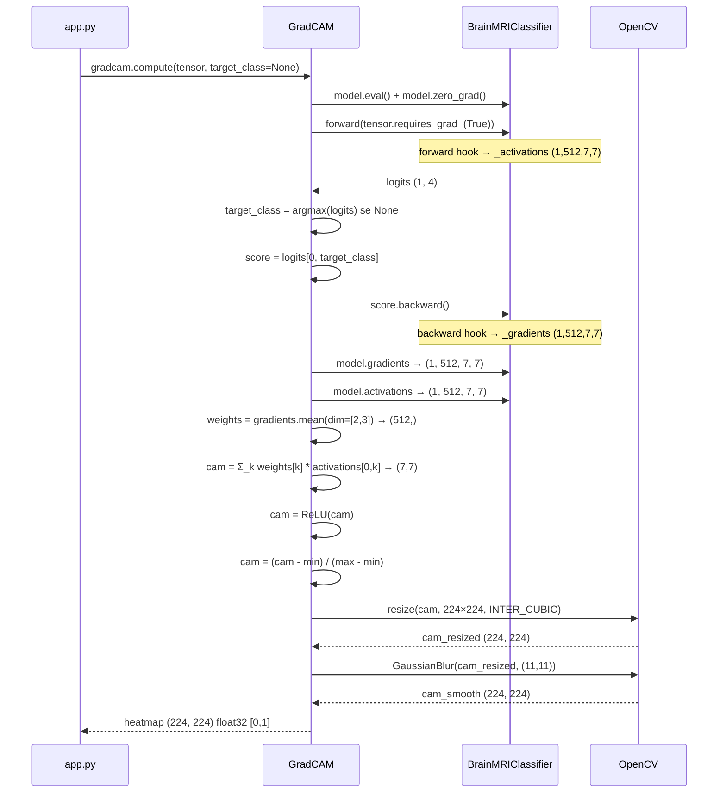
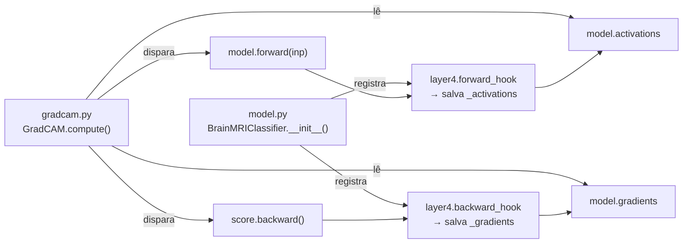

# 🔥 gradcam.py — Guia técnico e didático

> Implementação do algoritmo **Grad-CAM** para explicabilidade de redes neurais convolucionais aplicadas a MRI cerebral.
> Este documento explica a matemática, o código e as decisões de design por trás de cada etapa.

---

## Sumário

1. [O que é Grad-CAM?](#o-que-é-grad-cam)
2. [A matemática do algoritmo](#a-matemática-do-algoritmo)
3. [Fluxo de execução](#fluxo-de-execução)
4. [Passo a passo do código](#passo-a-passo-do-código)
5. [Funções de visualização](#funções-de-visualização)
6. [Como os hooks conectam model.py e gradcam.py](#como-os-hooks-conectam-modelpy-e-gradcampy)
7. [Casos de uso avançados](#casos-de-uso-avançados)
8. [Limitações e cuidados](#limitações-e-cuidados)
9. [Referências](#referências)

---

## O que é Grad-CAM?

Quando uma rede neural classifica uma imagem de MRI como "Glioma", ela não explica o motivo. Do ponto de vista clínico, isso é um problema grave: um modelo caixa-preta que diz "tem tumor" sem apontar *onde* não é confiável para apoio diagnóstico.

O **Grad-CAM** resolve isso gerando um mapa de calor (*heatmap*) que responde à pergunta:

> **"Quais regiões da imagem foram determinantes para esta classificação?"**

Regiões vermelhas no heatmap = alta influência na decisão.
Regiões azuis = baixa ou nenhuma influência.

```
Imagem MRI         Predição          Heatmap Grad-CAM
┌──────────┐       ┌──────────┐      ┌──────────┐
│          │  →→→  │ Glioma   │  →→→ │  🔴🔴    │
│  (MRI)   │  CNN  │ 93.1%    │  XAI │ 🔴🔴🔴🔴 │
│          │       │          │      │  🔴🔴    │
└──────────┘       └──────────┘      └──────────┘
                                      ↑ onde o modelo "olhou"
```

O Grad-CAM é uma técnica de **Explainable AI (XAI)** que funciona sem modificar a arquitetura do modelo e sem retreinar — ela usa apenas o que já existe dentro da rede.

---

## A matemática do algoritmo

### Passo 1 — Ativações da última camada convolucional

Durante o forward pass, a `layer4` do ResNet18 produz um tensor de ativações:

```
A^k ∈ ℝ^(h×w),   k = 1, 2, ..., K
```

Onde:
- `K = 512` — número de canais (detectores de features)
- `h = w = 7` — resolução espacial do mapa de features
- Cada `A^k` é um mapa 7×7 que representa o que o k-ésimo detector "viu" na imagem

### Passo 2 — Score da classe alvo

Para a classe alvo `c` (ex: Glioma = índice 0), extraímos o logit:

```
y^c = logits[0, c]   (escalar)
```

### Passo 3 — Gradientes por retropropagação

Calculamos `score.backward()` para propagar os gradientes de `y^c` de volta até a `layer4`:

```
∂y^c / ∂A^k_ij   para cada posição (i,j) de cada canal k
```

Esses gradientes dizem: *"se eu aumentar a ativação na posição (i,j) do canal k, o score da classe c aumenta ou diminui?"*

### Passo 4 — Pesos de importância (Global Average Pooling)

Para cada canal `k`, calculamos seu peso de importância `α^k_c` fazendo a média dos gradientes sobre todas as posições espaciais:

```
α^k_c = (1 / Z) Σᵢ Σⱼ  (∂y^c / ∂A^k_ij)
```

Onde `Z = h × w = 49`. Este passo é o **Global Average Pooling** dos gradientes.

`α^k_c` representa: *"o quanto o canal k, em média, influenciou a decisão para a classe c"*.

### Passo 5 — Mapa de ativação de classe (CAM)

Combinamos linearmente todos os mapas de ativação, ponderados pelos pesos `α`:

```
L^c_Grad-CAM = ReLU( Σ_k  α^k_c · A^k )
```

O **ReLU** descarta valores negativos (regiões que suprimiram a predição da classe alvo). Só nos interessa onde o modelo **ativou** para a classe, não onde ele **inibiu**.

### Passo 6 — Normalização e resize

```
L̂ = (L - min(L)) / (max(L) - min(L))   →   valores em [0, 1]
L̂_resized = resize(L̂, 224×224)          →   mesma resolução da imagem original
```

### Resumo visual da matemática

```
Ativações A^k    Gradientes ∂y^c/∂A^k
(1, 512, 7, 7)   (1, 512, 7, 7)
      │                  │
      │           GAP (mean dim=[2,3])
      │                  ↓
      │           pesos α^k  (512,)
      │                  │
      └──── Σ_k α^k · A^k ────→ CAM bruto (7, 7)
                                      │
                                    ReLU
                                      │
                                 normalização
                                      │
                                 resize 224×224
                                      │
                                 GaussianBlur
                                      ↓
                              heatmap final (224, 224) [0,1]
```

---

## Fluxo de execução



---

## Passo a passo do código

### `GradCAM.__init__`

```python
def __init__(self, model: BrainMRIClassifier) -> None:
    self.model = model
```

Apenas armazena a referência ao modelo. Os hooks já foram registrados pelo `BrainMRIClassifier.__init__()` — não registramos novos hooks aqui para evitar duplicatas (que causariam captura duplicada dos tensores).

---

### `GradCAM.compute` — forward pass

```python
self.model.eval()
self.model.zero_grad()

inp = input_tensor.clone().requires_grad_(True)
logits = self.model(inp)
```

**Por que `.clone()`?**
Evita modificar o tensor original passado pelo chamador. Boas práticas de imutabilidade.

**Por que `.requires_grad_(True)`?**
O autograd do PyTorch só constrói o grafo computacional para tensores com `requires_grad=True`. Sem isso, `score.backward()` não teria como propagar os gradientes até a `layer4`.

**Por que `model.eval()` se precisamos do backward?**
`eval()` não desativa o autograd — apenas desativa o Dropout e congela o BatchNorm. O grafo computacional é construído normalmente em `eval()`. O que desativa o autograd é `torch.no_grad()` — e por isso o código do `app.py` usa `torch.enable_grad()` ao chamar o Grad-CAM.

---

### `GradCAM.compute` — determinação da classe alvo

```python
if target_class is None:
    target_class = int(logits.argmax(dim=1).item())
```

**`target_class=None`** é o comportamento padrão: explica a predição real do modelo (a classe com maior score).

**`target_class=N`** permite calcular o heatmap para qualquer classe, independente da predição. Isso é útil para análise:

```python
# Onde o modelo "teria olhado" se fosse classificar como Meningioma?
heatmap_meningioma = gradcam.compute(tensor, target_class=1)
```

---

### `GradCAM.compute` — backward e captura dos gradientes

```python
score = logits[0, target_class]   # escalar
score.backward()
```

**Por que `logits[0, target_class]`?**
O backward precisa de um escalar como ponto de partida. Se passássemos o tensor `logits` inteiro, o PyTorch não saberia qual score propagar de volta. Extraímos exatamente o score da classe de interesse.

**O que acontece internamente:**
O autograd percorre o grafo computacional de `score` de volta até os parâmetros do modelo, calculando derivadas parciais em cada nó. Quando chega à `layer4`, o backward hook é disparado e captura `grad_out[0]` — os gradientes antes de passar para `layer3`.

---

### `GradCAM.compute` — pesos e combinação linear

```python
weights = gradients.mean(dim=[2, 3]).squeeze()   # (512,)

cam = torch.zeros(h, w, dtype=torch.float32)
for k, alpha in enumerate(weights):
    cam += alpha * activations[0, k]
```

**Por que `mean(dim=[2, 3])`?**
Fazemos o Global Average Pooling nas dimensões espaciais (dim=2 é altura, dim=3 é largura). Para cada um dos 512 canais, calculamos a média dos 49 gradientes (7×7), produzindo um único escalar de importância por canal.

**Por que um loop?**
Didaticamente mais claro que a versão vetorizada `(weights[:, None, None] * activations[0]).sum(dim=0)`. As duas são matematicamente idênticas; a versão vetorizada é mais eficiente em tensores grandes, mas para 512 canais de 7×7 a diferença é imperceptível.

---

### `GradCAM.compute` — ReLU

```python
cam = F.relu(cam)
```

Sem o ReLU, regiões com `α < 0` produziriam valores negativos no CAM — essas são regiões que **inibiram** a predição da classe alvo (ativaram outras classes). O Grad-CAM original inclui o ReLU como parte integral do algoritmo para focar apenas nas regiões de suporte positivo.

**Exemplo visual do efeito:**

```
Sem ReLU:   [-0.3, 0.1, -0.5, 0.8, 0.9, -0.2, 0.7]  (7 pixels de um corte)
Com ReLU:   [ 0.0, 0.1,  0.0, 0.8, 0.9,  0.0, 0.7]  → só o positivo fica
```

---

### `GradCAM.compute` — normalização min-max

```python
if cam_max > cam_min:
    cam = (cam - cam_min) / (cam_max - cam_min)
else:
    cam = torch.zeros_like(cam)
```

A verificação `cam_max > cam_min` previne divisão por zero no caso degenerado onde todos os valores do CAM são iguais (pode ocorrer com imagens muito atípicas ou classes nunca vistas no treino).

---

### `GradCAM.compute` — resize e suavização

```python
cam_resized = cv2.resize(cam_np, (output_size[1], output_size[0]),
                         interpolation=cv2.INTER_CUBIC)

cam_smooth = cv2.GaussianBlur(cam_resized, (11, 11), sigmaX=0)
```

**Por que INTER_CUBIC?**
Comparação das interpolações para upscaling 7×7 → 224×224 (fator 32×):

| Método | Qualidade | Velocidade |
|---|---|---|
| `INTER_NEAREST` | Blocos pixelados | Mais rápida |
| `INTER_LINEAR` | Suave mas com artefatos | Rápida |
| `INTER_CUBIC` | Mais suave, menos artefatos | Moderada |
| `INTER_LANCZOS4` | Máxima qualidade | Lenta |

`INTER_CUBIC` é o melhor custo-benefício para visualização médica.

**Por que GaussianBlur 11×11?**
O resize cria artefatos de ringing nas bordas das regiões de alta ativação. O kernel 11×11 é grande o suficiente para suavizá-los, mas pequeno o suficiente para não deslocar significativamente as regiões quentes.

`sigmaX=0` instrui o OpenCV a calcular o sigma automaticamente a partir do tamanho do kernel: `sigma = 0.3 × ((ksize-1) × 0.5 - 1) + 0.8 ≈ 1.7` para kernel 11×11.

---

## Funções de visualização

### `apply_colormap`

```python
def apply_colormap(heatmap: np.ndarray) -> np.ndarray:
```

Converte o heatmap escalar `[0, 1]` em uma imagem colorida usando o colormap **JET**:

```
0.00 → azul escuro   (rgb: 0,   0,   128)  — sem relevância
0.25 → ciano         (rgb: 0,   255, 255)
0.50 → verde/amarelo (rgb: 128, 255, 0  )  — relevância média
0.75 → laranja       (rgb: 255, 165, 0  )
1.00 → vermelho      (rgb: 255, 0,   0  )  — máxima relevância
```

> **Nota:** O JET é o colormap mais comum em neuroimagem por ser intuitivo (azul=frio=pouco, vermelho=quente=muito). Alternativas como Viridis ou Plasma são mais acessíveis para daltonismo, mas menos familiares na literatura médica.

### `blend_heatmap`

```python
def blend_heatmap(original_rgb, heatmap, alpha=0.5) -> np.ndarray:
```

Sobreposição linear entre imagem original e heatmap colorido:

```
resultado = α × original + (1-α) × heatmap_colorido
```

O parâmetro `alpha=0.5` é o padrão do paper original. No sistema, o slider de opacidade da UI mapeia diretamente para este parâmetro, permitindo que o usuário ajuste a intensidade do overlay em tempo real.

### `save_heatmap_png`

```python
def save_heatmap_png(heatmap, output_path) -> None:
```

Utilitário de debug: salva o heatmap colorido em disco. Útil para:
- Inspecionar visualmente heatmaps sem abrir o sistema completo
- Gerar datasets de heatmaps para artigos científicos
- Comparar heatmaps entre diferentes checkpoints do modelo

---

## Como os hooks conectam model.py e gradcam.py

Os dois arquivos são independentes mas acoplados pelos hooks registrados no modelo:



O `GradCAM` nunca registra hooks próprios nem acessa as camadas do modelo diretamente. Toda a captura de tensores é responsabilidade do `BrainMRIClassifier`. Isso respeita o princípio de separação de responsabilidades: o modelo gerencia seus próprios estados internos.

---

## Casos de uso avançados

### Comparar heatmaps entre classes

```python
model   = load_model("brain_mri_weights.pth")
gradcam = GradCAM(model)
tensor  = preprocess_image(img_rgb)

# Heatmap para cada classe — independente da predição real
for class_idx, class_name in enumerate(CLASS_NAMES):
    heatmap = gradcam.compute(tensor, target_class=class_idx)
    save_heatmap_png(heatmap, f"heatmap_{class_name}.png")
    print(f"{class_name}: gerado")
```

Isso responde: *"Se o modelo classificasse como Meningioma, onde ele teria olhado?"*. Útil para análise de erros: quando o modelo erra, ver os heatmaps de todas as classes revela se ele estava confuso entre regiões sobrepostas.

### Heatmap em resolução customizada

```python
# Gera heatmap em resolução maior para análise mais detalhada
heatmap_hd = gradcam.compute(tensor, output_size=(512, 512))
```

### Múltiplas imagens em sequência

```python
# O mesmo objeto GradCAM pode ser reutilizado para múltiplas imagens
# Os hooks são stateful — cada chamada a compute() sobrescreve os buffers
gradcam = GradCAM(model)

for img in mri_batch:
    tensor  = preprocess_image(img)
    heatmap = gradcam.compute(tensor)
    # processar heatmap...
```

> ⚠️ **Atenção:** O `GradCAM` **não é thread-safe**. Os buffers `_activations` e `_gradients` são compartilhados na instância do modelo. Em cenários com múltiplas requisições simultâneas (FastAPI com workers), cada worker deve ter sua própria instância de modelo e GradCAM, ou as chamadas devem ser serializadas com um lock.

---

## Limitações e cuidados

### Resolução espacial baixa

O mapa CAM tem resolução 7×7 antes do resize. Para tumores pequenos (< 5% da área da imagem), o Grad-CAM pode não localizar com precisão suficiente — a região quente cobre uma área maior que o tumor real. O **GradCAM++** (variante do algoritmo) e o **ScoreCAM** têm melhor resolução para objetos pequenos.

### Sensibilidade à classe alvo

O heatmap muda completamente dependendo da `target_class`. Sempre use `target_class=None` (predição real do modelo) para análise diagnóstica. Usar uma classe diferente da predição gera um heatmap hipotético que pode ser confundido com uma explicação real.

### Não é causalidade

O Grad-CAM mostra correlação, não causalidade. Uma região quente significa que aquela área foi importante para a predição — não que seja a causa do tumor. O modelo pode focar numa região adjacente ao tumor por correlação espúria no dataset de treino.

### Comportamento em `model.eval()` vs `model.train()`

Sempre chame `gradcam.compute()` com o modelo em modo `eval()`. Em modo `train()`, o Dropout altera aleatoriamente os gradientes a cada chamada, tornando os heatmaps não-determinísticos para a mesma entrada.

---

## Referências

- **Grad-CAM original**: Selvaraju et al. (2017) — [Grad-CAM: Visual Explanations from Deep Networks via Gradient-based Localization](https://arxiv.org/abs/1610.02391)
- **GradCAM++** (melhora para objetos pequenos): Chattopadhay et al. (2018) — [Grad-CAM++: Improved Visual Explanations for Deep Convolutional Networks](https://arxiv.org/abs/1710.11063)
- **Score-CAM** (sem gradientes): Wang et al. (2020) — [Score-CAM: Score-Weighted Visual Explanations for Convolutional Neural Networks](https://arxiv.org/abs/1910.01279)
- **PyTorch hooks**: [documentação oficial](https://pytorch.org/docs/stable/generated/torch.nn.Module.html#torch.nn.Module.register_forward_hook)
- **OpenCV colormaps**: [documentação cv2.applyColorMap](https://docs.opencv.org/4.x/d3/d50/group__imgproc__colormap.html)

---

*Parte do projeto [MRI Brain XAI Viewer](../README.md) · veja também [model.py](MODEL_README.md)*