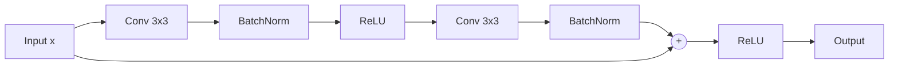
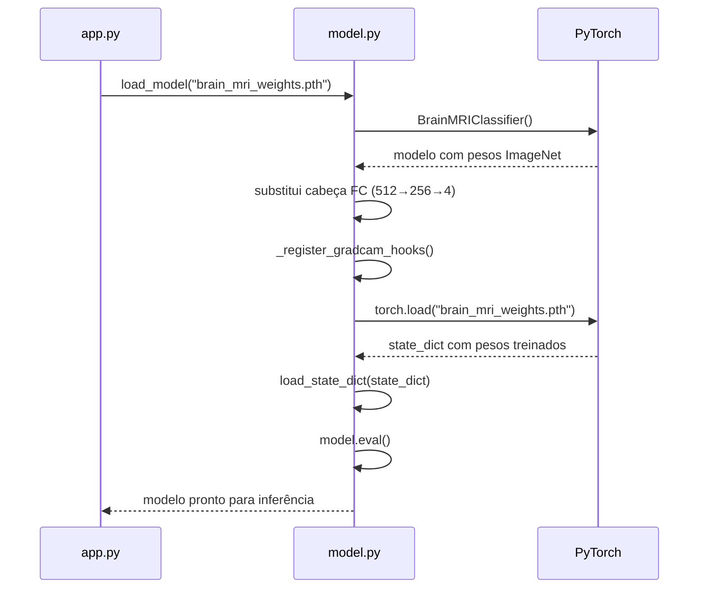
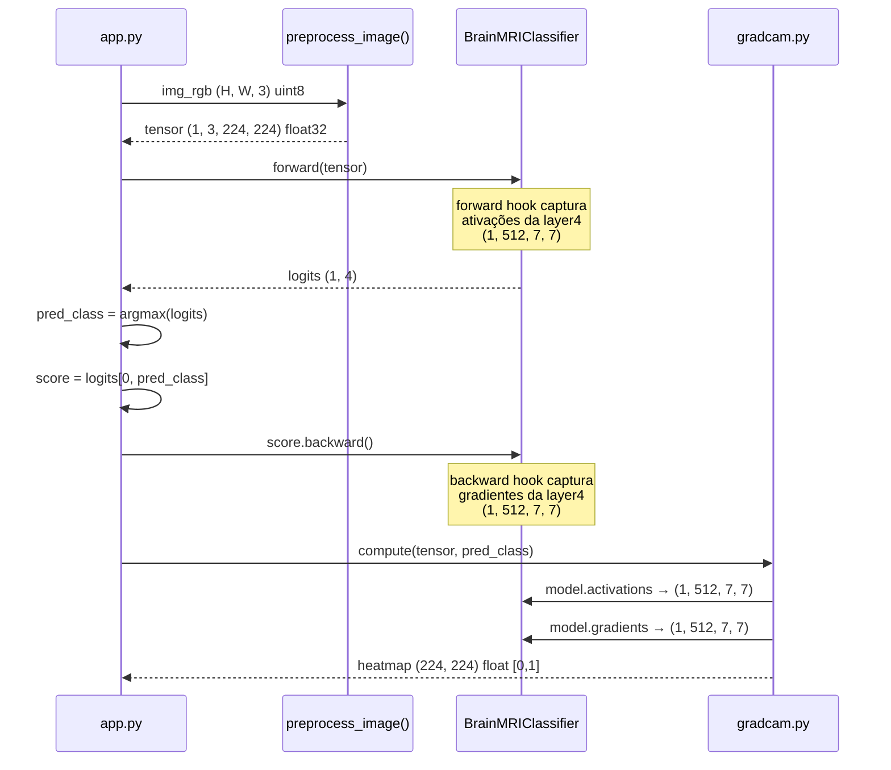
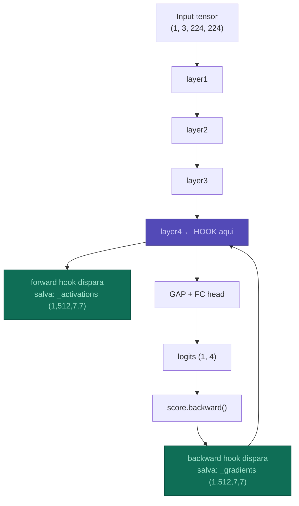

# 🧠 model.py — Guia técnico e didático

> Classificador de MRI cerebral baseado em **ResNet18 com fine-tuning completo**.
> Este documento explica cada decisão de design, o fluxo de execução e a matemática por trás do modelo.

---

## Sumário

1. [Visão geral](#visão-geral)
2. [Arquitetura](#arquitetura)
3. [Fluxo de execução](#fluxo-de-execução)
4. [Pré-processamento](#pré-processamento)
5. [Os hooks do Grad-CAM](#os-hooks-do-grad-cam)
6. [Carregamento dos pesos](#carregamento-dos-pesos)
7. [Por que ResNet18?](#por-que-resnet18)
8. [Transfer Learning explicado](#transfer-learning-explicado)
9. [A ordem das classes importa](#a-ordem-das-classes-importa)
10. [Referências](#referências)

---

## Visão geral

O `model.py` encapsula três responsabilidades em um único arquivo:

| Componente | Classe / Função | Responsabilidade |
|---|---|---|
| Arquitetura | `BrainMRIClassifier` | Define a rede neural e os hooks de XAI |
| Carregamento | `load_model()` | Injeta os pesos treinados no modelo |
| Dados | `preprocess_image()` | Prepara qualquer imagem para inferência |

O modelo classifica imagens de MRI cerebral em **4 classes**:

```
0 → Glioma           (tumor maligno, células gliais)
1 → Meningioma       (tumor geralmente benigno, meninges)
2 → Normal           (sem tumor detectado)
3 → Pituitary Tumor  (tumor na glândula pituitária)
```

---

## Arquitetura

O modelo é um **ResNet18 modificado**. A única alteração em relação ao ResNet18 original é a substituição da cabeça de classificação final:

```
Entrada: imagem MRI
  └── (1, 3, 224, 224) — batch=1, canais RGB, 224×224 pixels

ResNet18 Backbone (pré-treinado ImageNet, fine-tuned)
  ├── Conv1 + BN + ReLU + MaxPool
  ├── Layer1  (2x ResidualBlock, 64 filtros)
  ├── Layer2  (2x ResidualBlock, 128 filtros)
  ├── Layer3  (2x ResidualBlock, 256 filtros)
  └── Layer4  (2x ResidualBlock, 512 filtros)  ← hooks do Grad-CAM aqui
       └── ActivationMaps: (1, 512, 7, 7)

Global Average Pooling
  └── (1, 512)

Cabeça customizada (treinada do zero)
  ├── Linear(512 → 256)
  ├── ReLU
  ├── Dropout(p=0.5)
  └── Linear(256 → 4)

Saída: logits
  └── (1, 4) — um score por classe
```

### Diagrama de blocos residuais



> O bloco residual soma a entrada original com a saída transformada (`x + F(x)`).
> Isso resolve o problema do **vanishing gradient** em redes profundas: os gradientes
> têm um "atalho" para fluir de volta sem degradar.

---

## Fluxo de execução

### Fase de inicialização (uma vez ao iniciar o servidor)



### Fase de inferência (a cada requisição POST /analyze)



---

## Pré-processamento

A função `preprocess_image()` aplica um pipeline fixo de transformações:

```
img_rgb                                  shape: (H, W, 3)  dtype: uint8
    │
    ▼ ToPILImage()
objeto PIL                               modo: RGB
    │
    ▼ Resize((224, 224))
imagem redimensionada                    224×224 pixels
    │
    ▼ ToTensor()
tensor float32                           shape: (3, 224, 224)  range: [0.0, 1.0]
    │
    ▼ Normalize(mean=[0.485, 0.456, 0.406],
                std =[0.229, 0.224, 0.225])
tensor normalizado                       shape: (3, 224, 224)  range: ~[-2.1, 2.6]
    │
    ▼ unsqueeze(0)
batch tensor                             shape: (1, 3, 224, 224)
```

### Por que normalizar com valores do ImageNet?

Os pesos do backbone ResNet18 foram otimizados durante o treinamento no ImageNet com imagens normalizadas nesse intervalo específico. O modelo aprendeu a associar padrões de ativação a essas distribuições de pixel.

Usar uma normalização diferente é como calibrar uma balança para gramas e depois pesar em libras — o mecanismo funciona, mas os valores são sistematicamente incorretos.

A fórmula aplicada canal a canal é:

```
pixel_normalizado = (pixel_original - média) / desvio_padrão

Canal R: (pixel - 0.485) / 0.229
Canal G: (pixel - 0.456) / 0.224
Canal B: (pixel - 0.406) / 0.225
```

> **Nota sobre MRI:** Imagens MRI são originalmente em escala de cinza.
> Ao converter para RGB (replicando o canal 3x), a normalização ImageNet ainda
> se aplica — o backbone aprende a ignorar a redundância entre canais durante
> o fine-tuning.

---

## Os hooks do Grad-CAM

### O problema que os hooks resolvem

Para calcular o Grad-CAM, precisamos de dois tensores internos do modelo que normalmente não são expostos:

1. As **ativações** da última camada convolucional (o que o modelo "viu")
2. Os **gradientes** em relação a essas ativações (o que foi "importante")

Sem hooks, as duas únicas opções seriam: modificar o `forward()` para retornar tensores extras (quebra a interface), ou reprocessar a imagem uma segunda vez com instrumentação (ineficiente).

### Como os hooks funcionam

```python
# Forward hook — chamado automaticamente após layer4.forward()
def _save_activations(module, input, output):
    self._activations = output.detach()
    # output.shape = (1, 512, 7, 7)
    # 512 mapas de features, cada um 7×7 pixels

# Backward hook — chamado automaticamente durante score.backward()
def _save_gradients(module, grad_in, grad_out):
    self._gradients = grad_out[0].detach()
    # grad_out[0].shape = (1, 512, 7, 7)
    # gradiente de ∂score_classe / ∂ativações
```



### Por que `layer4`?

A `layer4` é a última camada convolucional antes do pooling global. Ela produz os mapas de features mais **semanticamente ricos** (detecta padrões complexos como formas de tumores) mas ainda com resolução espacial suficiente (7×7) para localizar *onde* na imagem esses padrões aparecem.

Camadas mais rasas (layer1, layer2) têm maior resolução espacial mas detectam apenas bordas e texturas simples — o heatmap seria ruidoso. A última camada antes da cabeça FC é o ponto ideal de compromisso.

---

## Carregamento dos pesos

### O que é um `state_dict`?

O `state_dict` é um dicionário Python onde:
- **Chave**: nome completo do parâmetro (ex: `"backbone.layer4.1.conv2.weight"`)
- **Valor**: tensor com os pesos aprendidos

```python
# Exemplo de entradas num state_dict do BrainMRIClassifier:
{
    "backbone.conv1.weight":              tensor de shape (64, 3, 7, 7),
    "backbone.layer4.1.conv2.weight":     tensor de shape (512, 512, 3, 3),
    "backbone.fc.0.weight":               tensor de shape (256, 512),
    "backbone.fc.3.weight":               tensor de shape (4, 256),
    # ... ~60 entradas no total
}
```

### Sequência de carregamento

```python
# 1. Valida que o arquivo existe
path = Path(checkpoint_path)
if not path.exists():
    raise FileNotFoundError(...)      # erro explícito com instrução de como resolver

# 2. Instancia o modelo com arquitetura correta (pesos aleatórios por ora)
model = BrainMRIClassifier(num_classes=4)

# 3. Deserializa o arquivo .pth para um state_dict Python
state_dict = torch.load(str(path), map_location="cpu")
#                                   └── garante compatibilidade CPU/GPU

# 4. Copia os valores treinados para os parâmetros do modelo
model.load_state_dict(state_dict)

# 5. Ativa modo de inferência
model.eval()
# ├── Dropout: desativado (p=0.0 em inferência)
# └── BatchNorm: usa estatísticas do treino (não recalcula)
```

### `map_location="cpu"` — por que importa?

Durante o treino no Colab (GPU T4), o PyTorch salva os tensores com referência ao dispositivo: `cuda:0`. Sem `map_location="cpu"`, tentar carregar esse arquivo numa máquina sem GPU lança `RuntimeError: CUDA error: no kernel image is available for execution`.

O `map_location="cpu"` instrui o PyTorch a carregar todos os tensores na RAM, independente de onde foram salvos. Se houver GPU disponível, o `app.py` pode mover o modelo depois com `model.to(device)`.

---

## Por que ResNet18?

### A família ResNet

| Modelo | Parâmetros | Top-1 ImageNet | Vel. inferência (CPU) |
|---|---|---|---|
| ResNet18 | 11.7M | 69.8% | ~40ms |
| ResNet34 | 21.8M | 73.3% | ~70ms |
| ResNet50 | 25.6M | 76.1% | ~120ms |
| ResNet101 | 44.5M | 77.4% | ~220ms |

O ResNet18 é o menor e mais rápido da família. Para um dataset de ~3.200 imagens em 4 classes, modelos maiores **não ajudam** — eles overfittam mais facilmente e são mais lentos sem ganho real de acurácia.

### Os blocos residuais (skip connections)

```
Bloco sem skip:    x → Conv → BN → ReLU → Conv → BN → ReLU → saída
Bloco residual:    x → Conv → BN → ReLU → Conv → BN → (+x) → ReLU → saída
                                                         ↑
                                              x passa direto aqui
```

A adição de `x` à saída transforma o problema de aprendizado. Em vez de aprender a transformação `F(x)`, a rede aprende o **resíduo** `F(x) - x`. Se a camada não for útil, ela pode simplesmente aprender `F(x) = 0`, preservando a informação original. Isso torna o treinamento de redes profundas muito mais estável.

---

## Transfer Learning explicado

### O que o backbone já sabe

O ResNet18 pré-treinado no ImageNet aprendeu uma hierarquia de features visuais:

```
Layer1 (camadas rasas)
  └── bordas horizontais, verticais, diagonais
  └── gradientes de cor

Layer2
  └── cantos, curvas
  └── combinações de bordas

Layer3
  └── texturas: grades, listras, padrões repetitivos
  └── partes de objetos: olhos, rodas, janelas

Layer4 (camadas profundas)
  └── conceitos semânticos: faces, formas anatômicas
  └── padrões complexos de alta ordem
```

Essas features de baixo e médio nível (bordas, texturas, formas) são **universais** — aparecem tanto em fotos de cachorros quanto em MRIs cerebrais. O fine-tuning permite que as camadas profundas se especializem em padrões médicos enquanto aproveitam o conhecimento das camadas rasas.

### O que muda com o fine-tuning

```
Antes do fine-tuning:
  Backbone → features genéricas ImageNet
  Cabeça   → logits para 1.000 classes ImageNet

Depois do fine-tuning (25 epochs, dataset MRI):
  Backbone → features adaptadas para texturas de MRI cerebral
  Cabeça   → logits para 4 classes de tumor
```

Todo o modelo é treinado (`requires_grad = True` em todos os parâmetros). A taxa de aprendizado baixa (`lr=1e-4`) e o `CosineAnnealingLR` garantem que o backbone é ajustado suavemente, sem destruir o conhecimento pré-existente do ImageNet.

---

## A ordem das classes importa

### O problema

O PyTorch `ImageFolder` ordena as subpastas **alfabeticamente** para atribuir os índices de classe. A estrutura do dataset Kaggle é:

```
Training/
├── glioma/       → índice 0
├── meningioma/   → índice 1
├── notumor/      → índice 2
└── pituitary/    → índice 3
```

### O bug silencioso

Se `CLASS_NAMES` estiver em ordem errada (ex: `["Normal", "Glioma", ...]`), o modelo pode classificar corretamente internamente (prediz índice 0 quando é Glioma), mas o sistema exibe o nome errado (mostra "Normal" para o índice 0).

```python
# ERRADO — vai exibir labels trocados:
CLASS_NAMES = ["Normal", "Glioma", "Meningioma", "Pituitary Tumor"]
#               ↑ índice 0 no modelo é Glioma, não Normal

# CORRETO — ordem alfabética das pastas do Kaggle:
CLASS_NAMES = ["Glioma", "Meningioma", "Normal", "Pituitary Tumor"]
#               ↑ índice 0 = glioma/ ✓
```

### Como verificar

Durante o treino, adicione esta linha para confirmar a ordem real usada pelo `ImageFolder`:

```python
train_data = datasets.ImageFolder(f"{DATASET_PATH}/Training", transform)
print(train_data.classes)
# Deve imprimir: ['glioma', 'meningioma', 'notumor', 'pituitary']
print(train_data.class_to_idx)
# Deve imprimir: {'glioma': 0, 'meningioma': 1, 'notumor': 2, 'pituitary': 3}
```

---

## Referências

- **ResNet**: He et al. (2015) — [Deep Residual Learning for Image Recognition](https://arxiv.org/abs/1512.03385)
- **Grad-CAM**: Selvaraju et al. (2017) — [Grad-CAM: Visual Explanations from Deep Networks](https://arxiv.org/abs/1610.02391)
- **Transfer Learning para MRI**: Tajbakhsh et al. (2016) — [Convolutional Neural Networks for Medical Image Analysis: Full Training or Fine Tuning?](https://ieeexplore.ieee.org/document/7426826)
- **Dataset**: Bhuvaji et al. — [Brain Tumor Classification MRI (Kaggle)](https://www.kaggle.com/datasets/sartajbhuvaji/brain-tumor-classification-mri)
- **PyTorch hooks**: [documentação oficial — register_forward_hook](https://pytorch.org/docs/stable/generated/torch.nn.Module.html#torch.nn.Module.register_forward_hook)

---

*Parte do projeto [MRI Brain XAI Viewer](../README.md).*